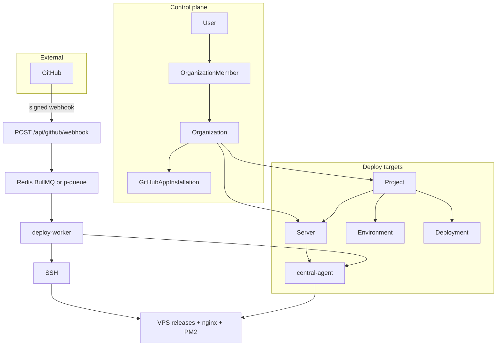
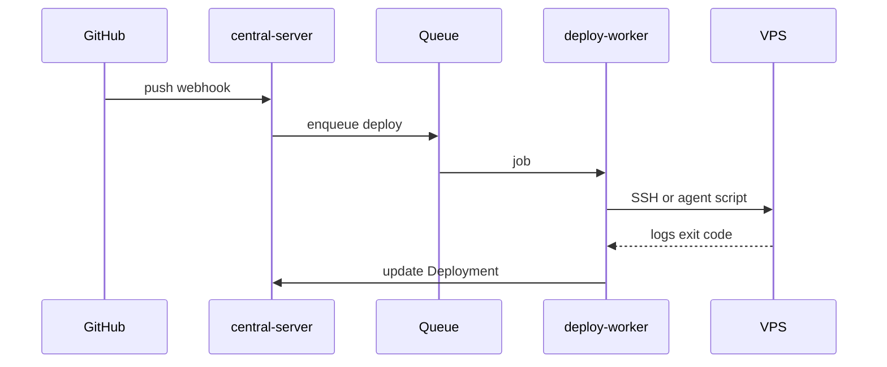

# Central Server — Product Requirements Document

| | |
|---|---|
| **Product** | Central Server |
| **Version** | 1.0 (living document) |
| **Status** | Active development |
| **Audience** | Product, engineering, operators |

**Related docs:** [README](../README.md) (quick start), [OPS.md](./OPS.md) (VPS operator runbook)

---

## 1. Executive summary

**Central Server** is a **hosted multi-tenant SaaS control plane** (self-host optional) for deploying Git repositories to **your own VPS** instances. Teams sign in, work inside **organizations**, connect a **GitHub App**, register **servers** (SSH or optional **central-agent**), and deploy **Laravel, Next.js, Node, static**, and related stacks via **git push** or the dashboard.

It is an alternative to renting a opaque PaaS (Heroku, Vercel) or manually scripting SSH, nginx, and PM2—without requiring Docker as the primary runtime model ([Coolify](https://coolify.io/docs/get-started/introduction) takes a container-first approach; Central takes a **release-directory + reverse-proxy** approach).

**Operator docs (web):** `/docs` — installation at `/docs/get-started/installation`, VPS runbook at `/docs/operations/vps`. Self-host install script: `GET /install.sh`.

**One-line pitch:** *GitHub-native, multi-tenant deploy control for your VPS—releases, nginx, PM2, logs, and rollback included.*

---

## 2. What Central Server is

| Capability | Description |
|------------|-------------|
| **Multi-tenant workspaces** | `Organization` per GitHub account/org; `OrganizationMember` roles |
| **Server registry** | SSH targets with **encrypted** private keys; per-server `deployRoot` |
| **Projects** | Repo + branch + stack + domain + generated nginx/Apache/PM2 |
| **Deployments** | Release dirs, `current` symlink, build, infra apply, streaming logs |
| **GitHub integration** | App installations, signed webhooks, push-to-deploy |
| **Queue** | BullMQ + Redis when `REDIS_URL` is set; in-process fallback otherwise |
| **VPS agent** | Optional `central-agent` for on-server job execution |
| **Platform admin** | Cross-tenant `/dashboard/admin` for operators |

---

## 3. What Central Server is not

Understanding boundaries avoids wrong expectations (mirrors Coolify’s “What Coolify Is Not” clarity):

| Central is **not** | Why |
|---------------------|-----|
| A **hosted cloud** that runs your apps | You provide VPS; Central orchestrates |
| **Docker-first** PaaS with one-click Postgres/Redis | No compose service catalog; apps run natively on the host |
| **Zero-SSH** | Servers need SSH access (or agent after pairing) |
| **GitLab / Bitbucket / Gitea** (today) | GitHub App–centric |
| **Kubernetes / Swarm** orchestration | Single-server deploy focus |
| **PR preview URLs** (today) | `preview` env scope exists; PR flow not built |
| **In-browser shell** (today) | Deployment/provision **log** streaming only |
| **Billing / Stripe** (today) | No subscription layer in product |

---

## 4. Positioning vs alternatives

| Platform | Model | Central difference |
|----------|--------|-------------------|
| **Coolify** | Docker, one-click services, broad language via containers | Central: **native** nginx/PM2/php-fpm, **GitHub App**, **org RBAC**, release layout |
| **Vercel / Netlify** | Managed edge + build | Central: **your** servers, **your** cost curve, full SSH control |
| **Heroku** | Managed dynos | Central: no dyno billing; you operate the host |
| **Raw SSH + scripts** | Manual | Central: UI, webhooks, templates, queue, audit-friendly RBAC |

---

## 5. Vision and success criteria

### Vision

Enable a small team or agency to run **many customer apps** on **their own VPS fleet** with the same ergonomics as a cloud PaaS: connect repo → pick server → deploy on push → see logs → rollback—while keeping data and runtime on infrastructure they control.

### Success criteria (product)

| # | Criterion | Status |
|---|-----------|--------|
| 1 | User signs in (GitHub OAuth) and lands in an org workspace | [Implemented] |
| 2 | Org roles enforced on dashboard and APIs | [Implemented] |
| 3 | Git push to configured branch queues deployment | [Implemented] |
| 4 | Deployment reaches VPS (SSH and/or agent) with release layout | [Implemented] |
| 5 | Laravel / Next / Node / static pipelines produce working configs | [Implemented] |
| 6 | Nginx apply is safe (preflight, `nginx -t`, rollback) | [Implemented] |
| 7 | No cross-project hostname conflict on same server | [Implemented] |
| 8 | Durable deploy queue when Redis enabled | [Implemented] |
| 9 | Platform admin can inspect users and orgs | [Implemented] |
| 10 | Production-ready ops (PG migrate, worker, docs, member UI) | [Implemented] |

**Definition of “complete” for v1:** success criteria 1–9 solid in production + Tier B hardening (Section 12), not full Coolify feature parity.

---

## 6. Personas

| Persona | Goals | Primary surfaces |
|---------|--------|------------------|
| **Platform operator** | Run Central instance, Postgres, Redis, secrets, upgrades | `.env`, `worker:deploy`, OPS.md |
| **Org owner / admin** | Servers, members, SSL, delete/provision, billing (future) | Servers, Settings, SSL panel |
| **Developer** | Deploy, env vars, infra edits | Projects, Deployments, Infra tab |
| **Viewer** | Audit status, read logs | Dashboard read-only |
| **Platform admin** | Cross-tenant support | `/dashboard/admin` |

---

## 7. Core concepts



| Concept | Description |
|---------|-------------|
| **Organization** | Workspace (GitHub org or personal account login) |
| **Server** | VPS connection: host, SSH user, encrypted key, TLS paths, agent state |
| **Project** | App: repository, branch, `deploymentPath`, framework, domain, configs |
| **Environment** | Named branch mapping (e.g. production) |
| **Deployment** | One run: `queued` → `running` → `success` / `failed` / `cancelled` |
| **ProjectDomain** | Hostname claims per server (uniqueness enforced) |
| **AgentJob** | Encrypted script executed on VPS when agent is online |

---

## 8. Functional requirements by area

Status legend: **[Implemented]** **[Partial]** **[Planned]** **[Out of scope]**

### 8.1 Authentication and tenancy

| ID | Requirement | Status |
|----|-------------|--------|
| AUTH-1 | Sign in via GitHub OAuth (better-auth) | [Implemented] |
| AUTH-2 | Session required for dashboard | [Implemented] |
| AUTH-3 | Organizations synced from GitHub memberships | [Implemented] |
| AUTH-4 | Org roles: owner, admin, developer, viewer | [Implemented] |
| AUTH-5 | Platform `User.role = admin` for `/dashboard/admin` | [Implemented] |
| AUTH-6 | Email/password sign-up and sign-in (open registration) | [Implemented] |
| AUTH-7 | Invite/manage org members in UI (non-GitHub-only) | [Partial] — members UI + add-by-email; no invite links |

### 8.2 GitHub

| ID | Requirement | Status |
|----|-------------|--------|
| GH-1 | GitHub App installation per org | [Implemented] |
| GH-2 | List repos/branches for wizard | [Implemented] |
| GH-3 | Remote stack detection (`detect-stack`) | [Implemented] |
| GH-4 | Signed webhook verification | [Implemented] |
| GH-5 | Push → deploy for matching project branch | [Implemented] |
| GH-6 | Webhook rate limits | [Implemented] |
| GH-7 | Legacy unsigned `/api/webhook` gated by env | [Implemented] |
| GH-8 | GitLab / Bitbucket / Gitea | [Planned] |

### 8.3 Servers

| ID | Requirement | Status |
|----|-------------|--------|
| SRV-1 | CRUD servers (org-scoped, RBAC) | [Implemented] |
| SRV-2 | SSH private key encrypted at rest | [Implemented] |
| SRV-3 | Capability probe (node, nginx, pm2, php, …) | [Implemented] |
| SRV-4 | Provision selected packages (Debian) | [Implemented] |
| SRV-5 | Server metrics panel | [Implemented] |
| SRV-6 | central-agent pair, heartbeat, jobs API | [Implemented] |
| SRV-7 | Agent-primary deploy (no SSH from app) | [Implemented] — full deploy+infra via agent; `AGENT_PRIMARY` disables SSH fallback |
| SRV-8 | First-connect validation wizard | [Planned] |

### 8.4 Projects and pipelines

| ID | Requirement | Status |
|----|-------------|--------|
| PRJ-1 | Multi-step create wizard | [Implemented] |
| PRJ-2 | Deploy pipeline mapping (Laravel, Next, Node, static, …) | [Implemented] |
| PRJ-3 | Auto port allocation (Node stacks) | [Implemented] |
| PRJ-4 | Monaco nginx/Apache/PM2 editors | [Implemented] |
| PRJ-5 | Env vars with secret encryption | [Implemented] |
| PRJ-6 | Monorepo / subdirectory detection | [Planned] |
| PRJ-7 | Docker pipeline production-quality | [Partial] |

### 8.5 Deployments

| ID | Requirement | Status |
|----|-------------|--------|
| DEP-1 | Manual deploy from dashboard | [Implemented] |
| DEP-2 | Release directory + `current` symlink | [Implemented] |
| DEP-3 | Build + start commands per stack | [Implemented] |
| DEP-4 | SSE deployment logs | [Implemented] |
| DEP-5 | Rollback to prior release (RBAC gated) | [Implemented] |
| DEP-6 | Cancel running deployment | [Implemented] |
| DEP-7 | Deployment timeline on project detail | [Implemented] |
| DEP-8 | Per-server deploy lock (one at a time) | [Implemented] |
| DEP-9 | PR / preview deployments | [Planned] |

### 8.6 Infrastructure (nginx / SSL)

| ID | Requirement | Status |
|----|-------------|--------|
| INF-1 | Generate nginx from templates | [Implemented] |
| INF-2 | Remote hostname preflight before enable | [Implemented] |
| INF-3 | `nginx -t` with atomic rollback | [Implemented] |
| INF-4 | Per-server unique hostnames (`ProjectDomain`) | [Implemented] |
| INF-5 | Let's Encrypt via certbot (dashboard) | [Implemented] |
| INF-6 | Auto-renewal on VPS + expiry alerts | [Implemented] — Renew now, VPS cron in OPS, `tlsCertNotAfter` + dashboard health alerts |
| INF-7 | Cloudflare origin cert upload | [Partial] |

### 8.7 Observability and health

| ID | Requirement | Status |
|----|-------------|--------|
| OBS-1 | Dashboard health alerts (failed deploys, stale agent, TLS hint) | [Implemented] |
| OBS-2 | Deployments list with duration | [Implemented] |
| OBS-3 | Email/Slack notifications | [Planned] |
| OBS-4 | Historical metrics retention | [Planned] |

### 8.8 Security

| ID | Requirement | Status |
|----|-------------|--------|
| SEC-1 | RBAC on destructive mutations | [Implemented] |
| SEC-2 | No SSH key material in public API responses | [Implemented] |
| SEC-3 | HTTP security headers (Next app) | [Implemented] |
| SEC-4 | Rate limits: webhook, deploy, detect-stack, agent pair | [Implemented] |
| SEC-5 | Distributed rate limit (Redis) | [Implemented] — when `REDIS_URL` is set |
| SEC-6 | Audit log for admin actions | [Planned] |

---

## 9. RBAC matrix

### Organization roles

| Capability | Owner | Admin | Developer | Viewer |
|------------|:-----:|:-----:|:---------:|:------:|
| View projects, servers, deployments | ✓ | ✓ | ✓ | ✓ |
| Manual deploy / cancel | ✓ | ✓ | ✓ | — |
| Edit project infra, env vars | ✓ | ✓ | ✓ | — |
| Register/edit servers | ✓ | ✓ | — | — |
| Provision, SSL write, rollback, delete | ✓ | ✓ | — | — |
| Manage org members | ✓ | ✓ | — | — |

Implementation: `src/lib/auth/permissions.ts`; UI uses `canDestructive`, `canManageServers`, etc.

### Platform admin

`User.role = admin` — access `/dashboard/admin`, promote users, inspect all orgs (operator use).

---

## 10. User journeys

### 10.1 Platform operator: first install

**Pre:** Node 20+, PostgreSQL, optional Redis, public URL for webhooks.

1. Clone repo, `cp .env.example .env`, set secrets.
2. `npm install` → `npx prisma migrate deploy` **or** `npm run db:bootstrap` if DB user lacks `public` schema rights (see `prisma/postgres-grants.sql`).
3. `npm run db:seed` after first GitHub sign-in with `PLATFORM_ADMIN_EMAIL` set.
4. `docker compose up -d redis` (optional), `npm run worker:deploy`.
5. `npm run dev` or production PM2.

**Post:** App serves UI; GitHub OAuth and App configured.

### 10.2 Org admin: connect server and agent

1. Dashboard → Servers → Add server (host, user, SSH key).
2. Optional: Provision stack packages.
3. Optional: Generate pairing token → run `npm run agent:pair` / `agent:run` on VPS.
4. Verify agent heartbeat on server detail.

### 10.3 Developer: create project and deploy

1. Settings → Install GitHub App.
2. Projects → New → installation, repo, branch.
3. Review detected pipeline; set domain, nginx.
4. Create project → Deploy.
5. Watch logs; open live preview when domain/TLS ready.

### 10.4 Push-to-deploy

1. Developer pushes to configured branch.
2. GitHub POSTs to `/api/github/webhook`.
3. Queue enqueues job; worker runs deploy.
4. Deployment record + logs updated.

### 10.5 Rollback

1. Admin+ opens project/deployments.
2. Rollback to prior successful release.
3. Symlink + PM2/nginx reload; new deployment row.

---

## 11. Architecture (technical summary)

| Layer | Technology |
|-------|------------|
| App | Next.js 16, React 19 |
| Auth | better-auth, PostgreSQL adapter |
| Control plane DB | PostgreSQL (production) or SQLite (local trial); Prisma 7 driver adapters |
| Queue | BullMQ + Redis, or in-process `p-queue` |
| Remote | ssh2, SFTP; optional `packages/central-agent` |
| VPS layout | `<deployRoot>/apps`, `configs`, `data`, `logs` |



---

## 12. Roadmap tiers

### Tier A — Core product [Implemented]

Phases 1–7 from engineering master plan: RBAC, GitHub hardening, Redis queue, agent API, nginx/SSL automation, stack pipelines, dashboard timeline and health alerts.

### Tier B — Production hardening [Implemented]

| Item | Status |
|------|--------|
| Postgres grants + `db:bootstrap` + `db:verify` | `prisma/postgres-grants.sql`, README production checklist |
| Worker + Redis required in production | `REQUIRE_REDIS_QUEUE` (default on in prod), failed enqueue without Redis |
| Agent-primary path | `AGENT_PRIMARY` + build+infra single agent script |
| Org member management UI | `/dashboard/settings/members` |
| SSL auto-renew + expiry monitoring | Renew now, OPS cron, `tlsCertNotAfter`, health alerts |
| Onboarding + prod warnings | Dashboard checklist + production config card |
| Distributed rate limits | Redis when `REDIS_URL` set |

### Tier C — Coolify-adjacent optional [Planned / out of scope]

| Item | Notes |
|------|-------|
| PR preview environments | Needs webhook + DNS pattern |
| S3 backups | Not in current architecture |
| In-browser terminal | High security scope |
| One-click databases | Docker/catalog pivot |
| Public REST API + tokens | Automation customers |
| GitLab/Bitbucket | Second provider |

---

## 13. Coolify parity reference

For stakeholders comparing to [Coolify](https://coolify.io/docs/get-started/introduction):

| Coolify feature | Central |
|-----------------|---------|
| Push to deploy | GitHub only (not GitLab/Gitea yet) |
| Any language | Strong on PHP/Node/static; Docker partial |
| One-click services | Not offered |
| Free SSL | Certbot + manual paths; auto-renew partial |
| PR deployments | Not yet |
| Collaboration | RBAC + workspace members UI (`/dashboard/settings/members`) |
| Real-time terminal | Logs only |
| Monitoring | Partial |
| Automatic backups | No |

**Product decision:** compete on **GitHub-native org SaaS + release deploys**, not Docker service catalog.

---

## 14. Non-functional requirements

| Area | Requirement |
|------|-------------|
| **Availability** | Deploy queue survives app restart when Redis enabled |
| **Security** | Encrypt SSH keys and secret env vars; verify webhook HMAC |
| **Isolation** | Org-scoped queries on all tenant resources |
| **Performance** | One deploy per server at a time; rate limits on hot paths |
| **Privacy** | Customer app code and DB stay on VPS; control plane stores metadata + secrets |
| **Observability** | Structured deployment logs; health alerts on dashboard |

---

## 15. Out of scope (v1)

- Stripe billing and usage metering
- Multi-region control plane
- Kubernetes as deploy target
- Managed “Central Cloud” hosting (business option only)
- Mandatory email verification before first login (SMTP not wired yet)

---

## 16. Open questions

| # | Question |
|---|----------|
| 1 | ~~Single-tenant install vs multi-tenant SaaS~~ — **Resolved:** product defaults to hosted multi-tenant SaaS; `DEPLOYMENT_MODE=self_hosted` for operators |
| 2 | Default to agent-only deploy when agent online? |
| 3 | Require Redis in production or keep p-queue fallback documented? |
| 4 | Invest in Docker pipeline vs deprecate in UI? |

---

## Appendix A — Environment variables

See [`.env.example`](../.env.example). Never commit `.env`.

| Variable | Required | Purpose |
|----------|----------|---------|
| `DATABASE_URL` | Yes | PostgreSQL connection string |
| `NEXT_PUBLIC_APP_URL` | Yes | Public app URL |
| `BETTER_AUTH_SECRET` | Yes | Session signing (32+ chars) |
| `BETTER_AUTH_URL` | Recommended | Auth callback origin |
| `ENCRYPTION_KEY` | Yes (servers) | SSH key encryption |
| `REDIS_URL` | Recommended | BullMQ deploy queue |
| `AGENT_JWT_SECRET` | Optional | Agent token signing |
| `PLATFORM_ADMIN_EMAIL` | Optional | Promote platform admin via seed |
| GitHub OAuth + App vars | Yes (integrations) | Login and deploy automation |

**PostgreSQL note:** If `prisma migrate deploy` fails with `permission denied for schema public`, run `prisma/postgres-grants.sql` as superuser or `npm run db:bootstrap`.

---

## Appendix B — API routes (reference)

| Method | Path | Purpose |
|--------|------|---------|
| `POST` | `/api/github/webhook` | Signed GitHub events (production) |
| `POST` | `/api/webhook` | Legacy unsigned (env-gated) |
| `POST` | `/api/deploy` | Queue deployment |
| `POST` | `/api/github/detect-stack` | Stack detection |
| `GET` | `/api/github/installations` | List installations |
| `POST` | `/api/agent/pair` | Agent pairing |
| `GET` | `/api/agent/jobs/next` | Agent poll job |
| `POST` | `/api/agent/heartbeat` | Agent heartbeat |
| `GET` | `/api/deployments/:id/logs` | Deployment log SSE |

Auth routes under `/api/auth/*` (better-auth).

---

## Appendix C — Repository layout

```text
src/app/dashboard/     # UI
src/lib/deploy/        # SSH, releases, apply-infra
src/lib/nginx/         # Domain validation, install, certbot
src/lib/github/        # Webhooks, detection, pipelines
packages/central-agent/
worker/deploy-worker.ts
prisma/                # Schema, migrations, bootstrap
docs/PRD.md            # This document
docs/OPS.md            # VPS operator guide
```

---

## Document history

| Date | Change |
|------|--------|
| 2026-05 | Initial PRD aligned with multi-tenant SaaS master plan and Coolify gap analysis |
